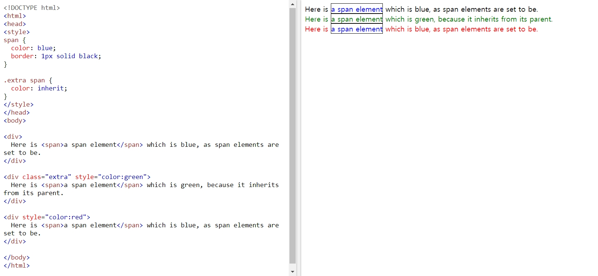

# Keyword: inherit

- 2019.04.17: 첫 작성

## inherit

- 사전적 의미: 상속받다, 물려받다
- 부모 element 의 설정을 그대로 물려받아서 사용함
- 예시
  
  - _출처: [W3SCHOOL](https://www.w3schools.com/cssref/tryit.asp?filename=trycss_inherit)_

## 출처

- [W3SCHOOL: CSS inherit Keyword](https://www.w3schools.com/cssref/css_inherit.asp)
