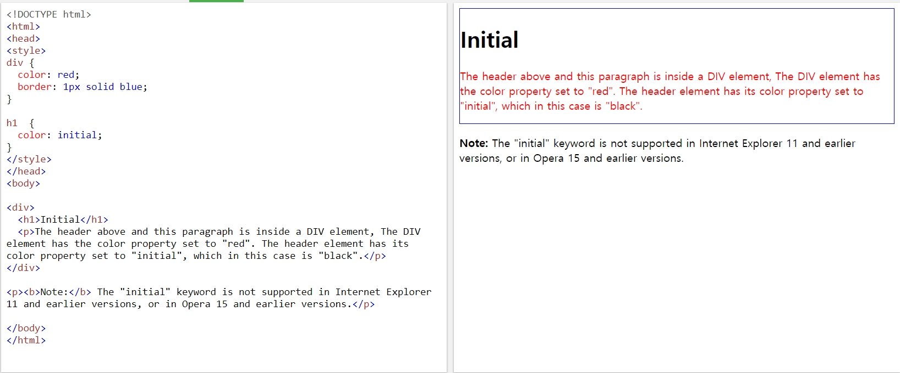

# Keyword: initial

- 2019.04.17: 첫 작성

## initial

- 사전적 의미: 처음의, 초기의
- 사전적 의미 그대로, 브라우저 내 초기의 설정 그대로 따르게 함
- 예시
  
  - _출처: [W3SCHOOL](https://www.w3schools.com/cssref/tryit.asp?filename=trycss_initial)_

## 출처

- [W3SCHOOL: CSS initial Keyword](https://www.w3schools.com/cssref/css_initial.asp)
