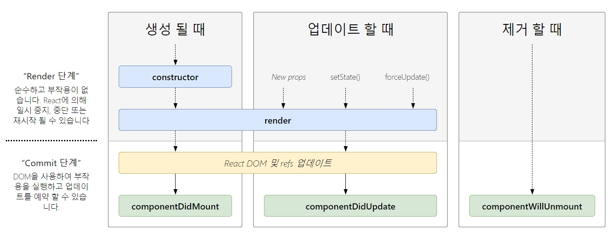

# React

## 작성 내역

- 2019.02.19 첫 작성
- 2019.03.11 전체 강의내용 정리 및 포멧 수정
- 2019.04.02~04 트렌스파일러 및 모듈 카테고리 독립 및 내용 추가

## 내용 정리

### ReactJS 특성

- 별도로 다른 프레임워크를 배울 필요 없이 JS 만 잘 알고 있으면 충분히 사용 가능
- Composition
  - 구조를 요소별, 컴포넌트별로 나눠서 작업 가능
- Undiretional Dataflow
  - 단방향 데이터플로우: Data changes UI
- 프레임워크가 아닌 UI 라이브러리 임.
- MVC 패턴에서 ReactJS 는 View 에 해당함. 따라서 M / C 부분에는 다른 것을 가져다 사용할 수 있음

### JSX

- syntax extension to JavaScript: JS 확장 구문
- React Component 를 만들 때 사용하는 언어
  - 꼭 JSX 를 사용해야만 하는 것은 아니지만, 있으면 개발이 훨씬 편해지기 때문에 사용을 권고함

### Element

- React 의 가장 작은 단위
  - React Component 의 구성 요소
  - 화면에 표시할 내용 기술

```JSX
const element = <h1>Hello, world</h1>;
```

- 일반 객체(plain object): 브라우저 DOM element 와 다름
- ReactDOM.render() 로 DOM 노드에 전달함

```JSX
ReactDOM.render(element, document.getElementById('root'));
// <div id="root"></div>
// id 가 root 인 div 안에 내용을 업데이트 한다.
```

- 불변객체(immutable object) 이므로 바꾸려면 새로운 element 를 생성한 후 render 에 전달해야 함

- 참고사항: React DOM 에서는 새로운 element 와 이전을 비교해서 필요한 경우에만 DOM 을 업데이트함
  - React DOM 에서 브라우저 DOM 을 효율적으로 업데이트함
  - [이해를 돕기위한 영상](https://www.youtube.com/watch?v=muc2ZF0QIO4)

### Components & Props

- Component

  - props 를 받은 후 elememt 반환: 데이터를 받은 후 HTML 태그로 뿌린다
    - JS 함수와 비슷: 데이터를 입력받으면 무언가를 Return
    - render 와 return 이 꼭 들어 있어야함
  - 함수 컴포넌트(Function component)와 클래스 컴포넌트(Class component)로 나뉨
    - Function component: Stateless 할 때 사용(state 를 받기만 하는 경우 사용), 생명주기 사용 불가능
  - Component Lifecycle
    
  - Component 디자인(모듈화) 요령
    - 가장 큰 부분을 app.js 에 담기: 페이지 전체
    - 이후 각각의 기능 및 사이즈를 정리해서 큰것부터 작은것으로 들어가게 디자인
      

- Props
  - 속성을 나타내는 데이터
  - 부모 Component 에서 자식 Component 로 데이터를 전달할 때 사용
  - props 가 Object 형태로 전달됨
  - Main Component 가 모든 Data 를 가지고 있고, 자식에게 Props 로 전달해서 사용 가능함
  - 순수함수처럼 동작해야 함
    - funtion 내에서 입력값을 바꾸게 하면 안됨
  - Prop-types
    - type 체크 & 문서화와 가독성 개선의 목적으로 사용
    - [자세한 사항은 블로그 내용 참조](https://medium.com/@sangboaklee/react-proptypes-%ED%99%9C%EC%9A%A9%ED%95%98%EA%B8%B0-7a0615da236)

```JSX
function Welcome(props) {
  return <h1>Hello, {props.name}</h1>;
}

const element = <Welcome name="Sara" />;
ReactDOM.render(
  element,
  document.getElementById('root')
);
```

### State

- State

  - React Component 안에 있는 Object
  - State 가 바뀔 때마다 Render 가 재실행된다
  - State 를 바꿀 때는 직접 접근하면 안됨 : setState 를 사용해서 변경해야 함
  - state 와 componentDidMount를 같이 사용하면 infinite scroll 같은 것도 만들 수 있음

  - 기존 데이터에 합쳐서 추가할 땐 아래 코드 필요함

  ```js
  ...this.state
  // ... : Spread Oprator
  // 한번에 모든 값들을 집어넣게 함
  // https://developer.mozilla.org/ko/docs/Web/JavaScript/Reference/Operators/Spread_syntax
  ```

- Loading State
  - API 에서 정보를 받아와서 state 를 업데이트 하려면 사용

## 출처

- [Nomad Coders - ReactJS로 웹 서비스 만들기](https://academy.nomadcoders.co/p/reactjs-fundamentals)
- [PoiemaWeb](https://poiemaweb.com/es6-babel-webpack-1)
- [React 공식 문서](https://ko.reactjs.org/docs/getting-started.html)
- [Jennybe - React+Redux | 2. React basic - Components, props, state](https://jennybeblog.github.io/2017-07-03/react_practice2/)
- [[React] PropTypes 활용하기](https://medium.com/@sangboaklee/react-proptypes-%ED%99%9C%EC%9A%A9%ED%95%98%EA%B8%B0-7a0615da236)
