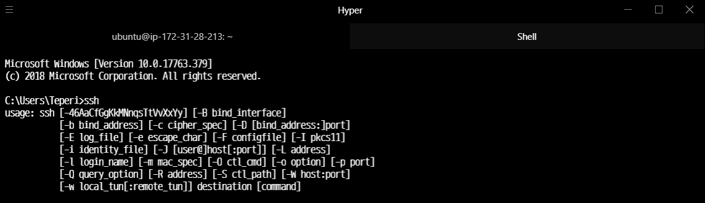
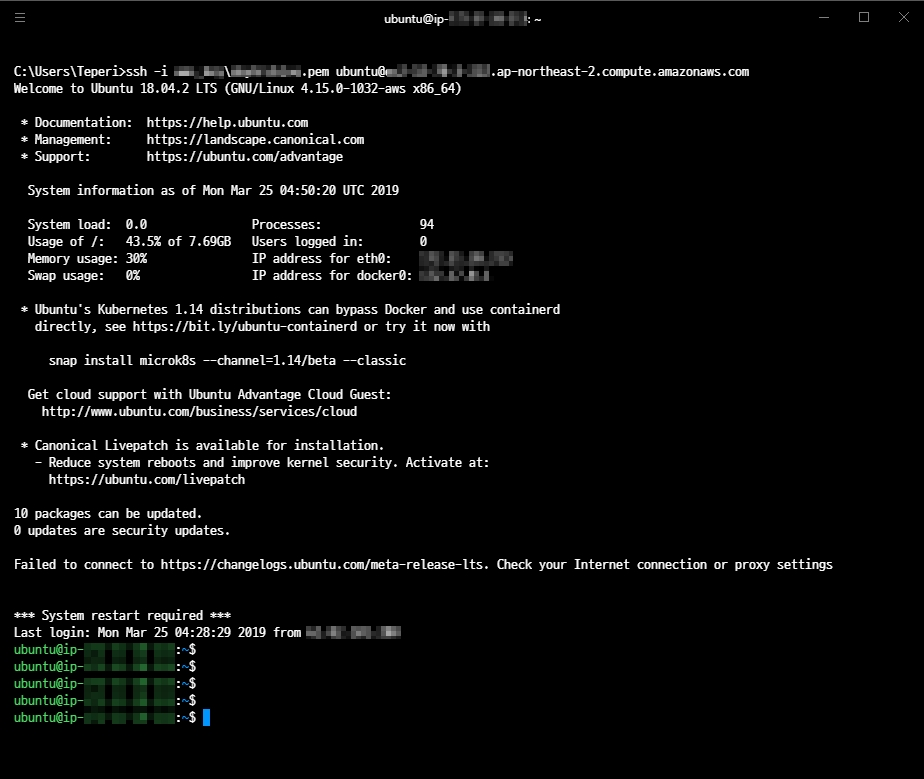

# PUTTY 없이 SSH 접속하기

- 2019.03.25: 첫 작성

## 목적

- Putty 터미널 보다 보기 좋은 터미널 프로그램 사용
- AWS SSH 접속

## 테스트 환경

- AWS 인스턴스: ubuntu 18.04
- 개발자 환경
  - OS: Windows 10
  - Terminal: Hyper / cmd.exe

## 준비물

- Terminal: cmd.exe(Command Prompt) 도 사용 가능
  - 내가 사용한 것: [Hyper](https://hyper.is/)
  - [다른 터미널 탐색용 링크](https://github.com/Awesome-Windows/Awesome#terminal)

- SSH 클라이언트
  - 확인 방법: cmd 또는 터미널에서 ssh 입력
  - 아래와 같이 뜬다면 따로 설치하지 않아도 됨
  
  - 설치방법: [윈도우 10 팁: putty가 더 이상 필요없다! 내장 OpenSSH 클라이언트 설치하기](https://archwin.net/402)

- AWS Private Key
  - Linux 인스턴스 설치 시 주는 pem 파일

## 연결 방법

```bash
# path\AWSKEY.pem : pem 파일 저장 경로 및 키 파일 이름 설정
# user_name: 우분투 설치 시 ubuntu, 다른 리눅스의 경우 출처에서 기본 사용자 이름 확인
# public_dns_name: 인스턴트 생성 시 확인 가능한 퍼블릭 DNS
ssh -i path\AWSKEY.pem user_name@public_dns_name
```

### 실행 결과



## 출처

- [SSH를 사용하여 Linux 인스턴스에 연결](https://docs.aws.amazon.com/ko_kr/AWSEC2/latest/UserGuide/AccessingInstancesLinux.html)