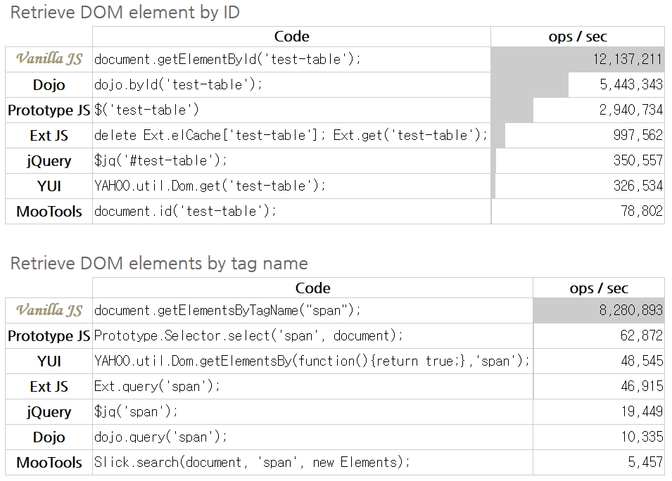

# Vanilla JS

## 강의 링크

[초보자를 위한 바닐라 JavaScript](https://academy.nomadcoders.co/p/javascript-basics-for-absolute-beginners-kr)

## 작성 내역

- 2019.02.13 첫 작성 (#1 완료)
- 2019.02.14 추가 (#2)
- 2019.02.15 추가 (#3)

## 내용 정리

### #1

- ECMAScript : 일종의 Specification
  - 각 브라우져들은 이 스펙을 적절히 구현해야 함
  - 현재 ES2016 까지는 왠만큼 구현이 되어 있음
- JavaScript(Vanilla JS): 모든 브라우저에서 사용 가능한 언어
  - jquery 로 작성한 코드를 웹 브라우저에서 실행할 경우, 기본적으로 브라우저에서 JS 로 컴파일해서 사용함
  - JS 가 가장 빠를 수 밖에 없음
  
  <sup id="sup1">[*출처1*](#footnote1)</sup>
  - 따라서 JS 를 배우는 것이 좋음

- 모든 언어는 문법과 규칙이 있음

- let : 변수 선언
- const : Constant, 상수 선언
  - 첫번째 값을 넣을때만 값이 들어감
  - const 선언된 변수를 바꾸려고 하면 에러 생성됨

- JS Data Type
  - String
  - Boolean
  - Number
  - Float

- Array & Object
  - JS Array: [] (bracket / Square brackets)
    - key 값이 각 자리마다 숫자로 저장
    - 리스트 형태로 저장할 자료에 유리함
  - JS Object: {} (Curly barckets)
    - lable:value 형태로 저장
    - Object.lable 로 불러올 수 있음
    - const 로 선언할 경우 각각의 value 는 변경 가능 / object 자체를 변경할 수 없음

---

### #2

- Console
  - **JS 에서 기본으로 제공해주는 Object**
  - log, error 등의 기능을 built-in Function 으로 제공해준다

- Function
  - 일정한 동작을 수행하는 코드
  - parameter: 매개변수<sup id="sup2">[*2*](#footnote2)</sup>
    - function 을 만들 때 사용하는 임의의 값
  - argument: 인수
    - function 을 실행할때 함수에 넣는 값
  - return: Fuction 의 동작 결과를 보냄

- Backtick( ` )
  - String 에 Backtick 을 사용할 경우 변수를 불러오기 용이함

  ```js
  name = "SG";
  console.log(`Hello ${name}`);
  //result: Hello SG
  ```

- DOM
  - Document Object Model
  - HTML 태그를 가져다 Object 로 만들어 줌
  - Console.log 와 .dir 의 차이<sup id="sup3">[*3*](#footnote3)</sup>
    - console.log : HTML과 같은 트리 구조로 출력
    - console.dir : JSON과 같은 트리 구조로 출력
  - Event
    - 클릭, 입력 등의 효과
    - JS 는 이런 이벤트를 받아 원하는대로 변경하기 위해 만들어진 언어
    - MDN 에 Event 상태에 대한 설명이 모두 있다.

- CSS, HTML, JS 분리
  - HTML: Tag 관리
  - CSS: CSS 관리
  - JS: 로직 처리

- CSS transition
  - Animation 역할
  - 변화하는 부분 / 시간 / 동작형식 순서로 지정

---

### #3

- 조건부 삼항 연산자(conditional ternary operator)
  - ifelse 문의 축약형으로 빈번히 사용됨
  - condition ? trueValue : falseValue 형태
  - 조건을 중첩해서 쓰는 것은 피해야 하겠지만, 단순한 ifelse 관계의 경우 사용하면 코드 길이가 줄어드는 효과가 있다.

- Web Storage<sup id="sup4">[*4*](#footnote4)</sup> <sup id="sup5">[*5*](#footnote5)</sup>
  - 쿠키보다 사용하기 편하고 용량이 큼
  - sessionStorage 와 LocalStorage 로 나누어짐
  - HTML5 에서 도입된 개념
  - String 만 저장됨

- event.preventDefault
  - submit, 뒤로가기 등의 행동을 할때, 기본적으로 하는 그 행동들을 막아줌
  - 이후 JS 코드를 통해 내가 원하는 행동으로 바꿔줄 수 있음

- filter
  - Array ForEach 에 filter 기능을 추가
  - 판별 함수를 통과하는 요소를 가지고 새로운 Array 를 만들어 줌

## 출처

<b id="footnote1">출처1</b> : [Vanilla-JS](http://vanilla-js.com/) [↩](#sup1)

<b id="footnote2">2</b> : [블로그: 파라미터 와 아규먼트 차이](https://enarastudent.tistory.com/entry/%ED%95%A8%EC%88%98%EC%9D%98-%EC%95%84%EA%B7%9C%EB%A8%BC%ED%8A%B8%EC%99%80-%ED%8C%8C%EB%9D%BC%EB%AF%B8%ED%84%B0%EC%9D%98-%EC%B0%A8%EC%9D%B4) [↩](#sup2)

<b id="footnote3">3</b> : [MDN : console.log()](https://developer.mozilla.org/ko/docs/Web/API/Console/log#console.dir()_%EA%B3%BC%EC%9D%98_%EC%B0%A8%EC%9D%B4) [↩](#sup3)

<b id="footnote4">4</b> : [MDN : Web Storage API](https://developer.mozilla.org/ko/docs/Web/API/Web_Storage_API) [↩](#sup4)

<b id="footnote5">5</b> : [W3SCHOOL : HTML5 Web Storage](https://www.w3schools.com/html/html5_webstorage.asp) [↩](#sup5)
