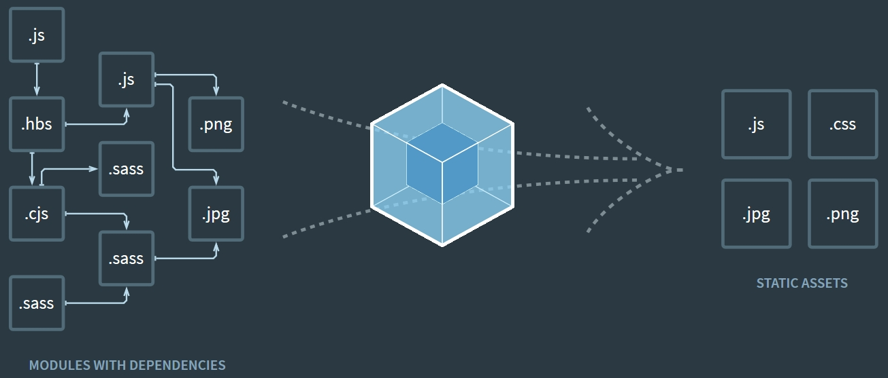

# Module & Transpiler

- 2019.04.02: 첫 작성(React 에서 분할됨)

## 트랜스파일러(transpiler) / 크로스 컴파일러

- 특정 언어로 작성된 프로그램을 다른 언어에서 실행되도록 변환

### Babel

- ES6+ 코드를 ES5 이하의 버전으로 바꿔줌
  - 이로 인해 브라우저 호환성을 높일 수 있음
    

## Modular Programming

- Module: 각 기능별로 분할한 것
  - Modular programming(모듈성): 하드웨어 또는 소프트웨어를 추가/변경할 때, 전체에 영향 없이 일부만 바꿀 수 있도록 개발
- JS 에는 일일이 script Tag 로 불러왔었음
  - 문제점: 순서 문제 생김, 변수 이름 겹칠 시 에러 발생 등
  - 현재 ES6 에서는 지원을 하기로 되어있으나, 아직 많은 브라우저가 ES6에 완벽 대응하지 않음
- JS를 범용적인 목적(브라우저 환경 외 다른 곳에서 사용 ex-Windows 등)으로 사용하기 위해서도 모듈화는 필요함

### Webpack

- Static Module Bundler: 모듈화된 js 파일을 다시 1개의 js 파일로 만들어주는 역활
  - 브라우저에서 호환되지 않는 문제 해결 가능

_출처:_ [_webpack 공식 사이트_](https://webpack.js.org/)

## 출처

- [PoiemaWeb](https://poiemaweb.com/es6-babel-webpack-1)
- [자바스크립트 모듈, 모듈 포맷, 모듈 로더와 모듈 번들러에 대한 10분 입문서](https://github.com/codepink/codepink.github.com/wiki/%EC%9E%90%EB%B0%94%EC%8A%A4%ED%81%AC%EB%A6%BD%ED%8A%B8-%EB%AA%A8%EB%93%88,-%EB%AA%A8%EB%93%88-%ED%8F%AC%EB%A7%B7,-%EB%AA%A8%EB%93%88-%EB%A1%9C%EB%8D%94%EC%99%80-%EB%AA%A8%EB%93%88-%EB%B2%88%EB%93%A4%EB%9F%AC%EC%97%90-%EB%8C%80%ED%95%9C-10%EB%B6%84-%EC%9E%85%EB%AC%B8%EC%84%9C)
- [제타위키 - 모듈, 모듈화, 모듈성](https://zetawiki.com/wiki/%EB%AA%A8%EB%93%88,_%EB%AA%A8%EB%93%88%ED%99%94,_%EB%AA%A8%EB%93%88%EC%84%B1)
- [NAVER D2 - JavaScript 표준을 위한 움직임: CommonJS와 AMD](https://d2.naver.com/helloworld/12864)
- [NAVER D2 - JavaScript 모듈화 도구, webpack](https://d2.naver.com/helloworld/0239818)
- [자바스크립트의 모듈화와 표준에 대하여](https://sy34.net/javascript-module-and-standard/)
